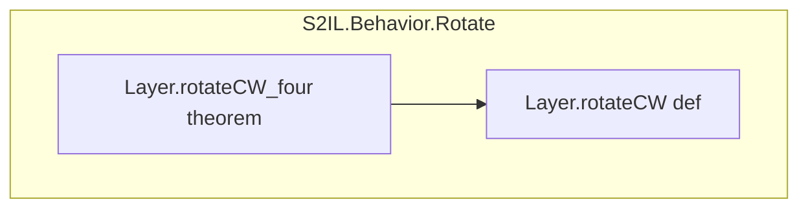

# 証明依存グラフの生成 (DepGraph)

Lean の `Environment` API を使用して、プロジェクト内の定理・定義間の依存関係を有向グラフとして出力する。
ソースコードの全文検索ではなく、コンパイル済み環境からメタプログラミングで依存を抽出するため高精度・低コスト。

## 前提条件

- **lean-setup** スキルでツールチェインが利用可能であること
- プロジェクトがビルド可能であること（`lake build` が成功する状態）

## 依存関係

```
lean-setup → lean-depgraph (内部で lake build depgraph → S2IL も自動ビルド)
```

## 手順

### 1. スクリプトの実行

シェル名を前置せず、スクリプトを直接実行すること。

- **Windows**: `.github/skills/lean-depgraph/scripts/depgraph.ps1`
- **macOS / Linux**: `.github/skills/lean-depgraph/scripts/depgraph.sh`

### 2. オプション

| オプション | デフォルト | 説明 |
|---|---|---|
| `-Private` / `--private` | off | **private 宣言を含める**（詳細把握用） |
| `-Json` / `--json` | off | JSON 形式で出力（デフォルト: Mermaid） |
| `-Namespace <name>` / `--ns <name>` | `S2IL` | 対象モジュールプレフィックス |
| `-TheoremsOnly` / `--theorems-only` | off | **定理のみ表示**（全容把握用、コンテキスト節約） |
| `-Output <path>` / `--output <path>` | `.lake/depgraph.md` | 出力ファイルパス |
| `-Root <name>` / `--root <name>` | （全体） | **起点宣言を指定**し、そこを含む部分グラフのみ出力 |
| `-RootReverse` / `--root-reverse` | off | `--root` と併用。逆方向に辿る（依存元を追跟） |
### 3. 使い分けの指針

| 目的 | 推奨オプション | 説明 |
|---|---|---|
| 全容の俯瞰 | `-TheoremsOnly` | 定理のみで依存関係をコンパクトに把握 |
| 詳細な依存分析 | (デフォルト) | 定義も含めた完全な依存グラフ |
| private を含む完全グラフ | `-Private` | 内部実装の依存も可視化 |
| 後続の自動解析 | `-Json` | JSON 形式でプログラム的に処理 |
| 特定モジュール限定 | `-Namespace S2IL.Behavior` | サブモジュールに絞り込み |
| 定理が依存するものを追跟 | `-Root S2IL.Behavior.Rotate.Layer.rotateCW_four` | 指定宣言から依存先をBFSで辿る |
| 定理を使う宣言を追跟 | `-Root S2IL.Behavior.Rotate.Layer.rotateCW -RootReverse` | 指定宣言に依存する宣言をBFSで辿る |
### 4. 直接実行（lake exe）

スクリプトを介さず直接実行することも可能:

```shell
lake exe depgraph --theorems-only --output .lake/depgraph.md
lake exe depgraph --json --output .lake/depgraph.json
lake exe depgraph --private --ns S2IL.Behavior

# 特定の定理を起点として依存先を辿る（この定理が何を使っているか）
lake exe depgraph --root S2IL.Behavior.Rotate.Layer.rotateCW_four

# 特定の定義を起点として依存元を辿る（この定義を誰が使っているか）
lake exe depgraph --root S2IL.Behavior.Rotate.Layer.rotateCW --root-reverse
```

## 出力形式

### Mermaid 形式（デフォルト）

モジュールごとにサブグラフとしてグループ化された有向グラフ:



- ノードラベル: `宣言名  種別`
- sorry を含む宣言: 赤系スタイルで強調
- エッジ: `A --> B` は「A が B に依存」を意味

### JSON 形式

```json
{
  "nodes": [
    {"name": "Layer.rotateCW", "kind": "def", "module": "S2IL.Behavior.Rotate", "sorry": false, "private": false}
  ],
  "edges": [
    {"from": "Layer.rotateCW_four", "to": "Layer.rotateCW"}
  ]
}
```

## 構造化出力

スクリプトは結果を以下の形式で出力する:

- **グラフ本体**: 指定パスまたは `.lake/depgraph.md` (`.json`)
- **サマリー** (stdout): `=== DEPGRAPH RESULT ===` 〜 `=== END DEPGRAPH ===`
- **統計情報**: ノード数・エッジ数・sorry 数

## 技術的な仕組み

1. `DepGraph.lean` が `import S2IL` により S2IL ライブラリの全モジュールを読み込む
2. 実行時に `Lean.importModules` で `Environment` をロード
3. `env.header.moduleData` からモジュール単位で宣言を走査（全文検索不要）
4. `Expr.foldConsts` で各宣言の型・値に現れる定数参照を収集
5. 対象モジュール内の宣言間のエッジのみを出力

## トラブルシューティング

- `lake` が見つからない → **lean-setup** スキルを参照
- ビルドエラー → **lean-build** スキルで先にビルドを確認
- 出力が空 → `--ns` プレフィックスが正しいか確認（デフォルト: `S2IL`）
- グラフが巨大 → `--theorems-only` で定理のみに絞る、または `--ns` でサブモジュールに限定
