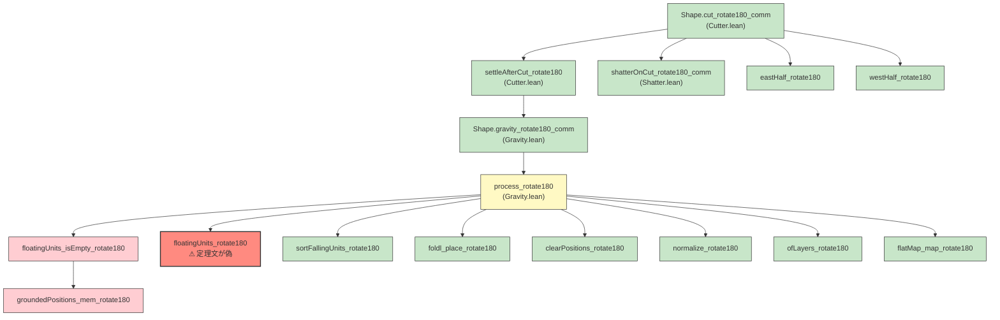
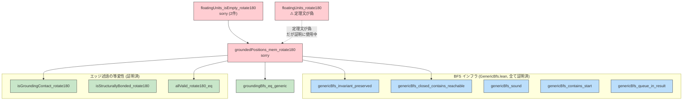
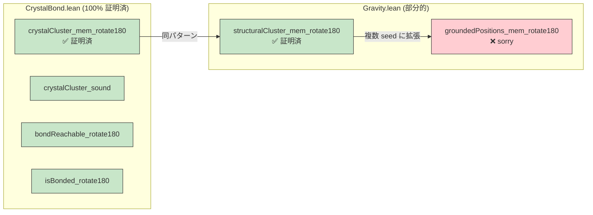

# Gravity rotate180 等変性の証明計画

> 作成日: 2025-07

## 1. 現状のまとめ

### 1-1. sorry 残数

プロジェクト全体で **sorry は 4 件**。全て [Gravity.lean](../S2IL/Behavior/Gravity.lean) に集中している。

| # | 定理名 | 行番号 | 状態 | 概要 |
|---|---|---|---|---|
| S-1 | `groundedPositions_mem_rotate180` | L1042 | `sorry` | 接地位置のメンバーシップが rotate180 で保存される |
| S-2 | `floatingUnits_rotate180` | L1055 | `sorry` | `floatingUnits` のリスト等値（**定理文が偽**） |
| S-3 | `floatingUnits_isEmpty_rotate180` (case 1) | L1067 | `exfalso; sorry` | s に浮遊単位あり → s.r180 にもあり |
| S-4 | `floatingUnits_isEmpty_rotate180` (case 2) | L1068 | `exfalso; sorry` | s に浮遊単位なし → s.r180 にもなし |

### 1-2. 他モジュールの完成度

| モジュール | 定理数 | sorry数 | 完成度 |
|---|---|---|---|
| CrystalBond.lean | 43 | 0 | 100% |
| Shatter.lean | 38 | 0 | 100% |
| Cutter.lean | 23 | 0 | 100% |
| GenericBfs.lean | 12 | 0 | 100% |
| **Gravity.lean** | **68** | **4** | **94%** |

---

## 2. 証明の依存関係グラフ

### 2-1. 最上位定理から sorry までの全体像



### 2-2. BFS に帰着する依存チェーン



### 2-3. 既に証明完了の類似定理との比較



---

## 3. ボトルネック分析

### 3-1. 直接の問題: `groundedPositions_mem_rotate180`

`crystalCluster_mem_rotate180` と `structuralCluster_mem_rotate180` は
**単一の start 位置** から BFS を開始するため、以下のパターンで証明されている:

1. BFS 健全性 (`genericBfs_sound`) で「結果の要素は start から到達可能」
2. BFS 閉包性 (`genericBfs_invariant_preserved`) で「到達可能な全頂点が結果に含まれる」
3. `start.rotate180` が結果に含まれることを `genericBfs_contains_start` で確認
4. 到達可能性の rotate180 保存 (`bondReachable_rotate180` 等) で接続

`groundedPositions` は **レイヤ 0 の全非空象限を seed** として BFS を開始する。
単一 seed のパターンを複数 seed に拡張する必要がある。

これは `genericBfs_queue_in_result`（キューの全要素が結果に含まれる）を活用すれば
対処可能であり、**証明困難度は中程度**。

### 3-2. 根本的な問題: `floatingUnits_rotate180` が偽

現在の定理文:
```lean
theorem floatingUnits_rotate180 (s : Shape) :
        (floatingUnits s).map FallingUnit.rotate180 =
        floatingUnits s.rotate180
```

**この定理文は偽である。** 理由:

1. `floatingUnits` は内部で `allStructuralClusters` を呼び出す
2. `allStructuralClusters` は `allValid s` の順序で bondable 位置を走査し、BFS でクラスタを発見する
3. `s` と `s.rotate180` では `getQuarter s p` と `getQuarter s.r180 p` が異なるため、bondable 位置の列挙順序が異なる
4. BFS は走査開始位置に依存して異なる順序で結果を返す
5. `List.map rotate180` は要素の順序を変える (ne↔sw, se↔nw)

結果として `(floatingUnits s).map r180 ≠ floatingUnits s.r180` が一般に成立する。
**リストの等値ではなく、集合レベルの等価性が正しい命題**である。

### 3-3. 波及範囲: sorry の汚染チェーン

`floatingUnits_rotate180` と `floatingUnits_isEmpty_rotate180` の sorry は
以下の定理チェーンに波及する:

```
floatingUnits_rotate180 (偽)
  → process_rotate180 の h_sorted / h_obs
    → Gravity.process_rotate180
      → gravity_rotate180_comm
        → settleAfterCut_rotate180 (Cutter.lean)
          → cut_rotate180_comm (Cutter.lean)
```

つまり **`cut_rotate180_comm` も sorry に汚染**されている。
Lean コンパイラは sorry を含む証明を受理するが、形式的には未完成である。

### 3-4. BFS が問題の本質か

**BFS 自体は問題ではない。** BFS の健全性・完全性は `GenericBfs.lean` で十分に証明されており、
単一 seed のケース (`crystalCluster`, `structuralCluster`) は既に完全証明済みである。

**真の問題は以下の2点:**

1. **複数 seed の BFS 完全性**: `groundedPositions` は複数 seed を使うが、
   これは既存インフラの自然な拡張で対処可能
2. **リスト順序への依存**: `floatingUnits` の結果がリストとして rotate180 等変でない。
   `process_rotate180` の証明が `floatingUnits` のリスト等値に依存している
   設計になっており、これが根本原因

---

## 4. 対処方針

### 4-1. 方針の概要

3段階で対処する:

| Phase | 内容 | 難易度 | 変更範囲 |
|---|---|---|---|
| **G-1** | `groundedPositions_mem_rotate180` の証明 | 中 | Gravity.lean 内部 |
| **G-2** | `floatingUnits_isEmpty_rotate180` の証明 | 低 | Gravity.lean 内部 |
| **G-3** | `process_rotate180` の証明再構築 | 高 | Gravity.lean + 関連定義の変更 |

### 4-2. Phase G-1: `groundedPositions_mem_rotate180`

#### 目標

```lean
theorem groundedPositions_mem_rotate180 (s : Shape) (p : QuarterPos) :
        (groundedPositions s).any (· == p) =
        (groundedPositions s.rotate180).any (· == p.rotate180)
```

#### 証明戦略

`structuralCluster_mem_rotate180` と同じパターンで証明する。
差分は BFS の初期キューが複数 seed であること。

**手順:**

1. **到達可能述語の定義**: 接地接触チェーンによる到達可能性
   ```lean
   -- GroundingReachable s seeds p:
   -- seeds のいずれかから isGroundingContact 経由で p に到達可能
   inductive GroundingReachable ...
   ```
   ※ 既存の `GenericReachable (isGroundingContact s)` を利用可能

2. **seed 集合の rotate180 等変性**: レイヤ 0 の非空象限の集合が等変であることを示す
   ```lean
   -- seeds s.r180 のメンバー p に対して、p.r180 は seeds s のメンバー
   theorem seeds_mem_rotate180 ...
   ```
   - `getQuarter_rotate180`（証明済み）と `allValid_rotate180_eq`（証明済み）から導出

3. **BFS 完全性の適用**: `genericBfs_invariant_preserved` + `genericBfs_closed_contains_reachable` で
   到達可能な全頂点が BFS 結果に含まれることを示す

4. **seed の結果包含**: `genericBfs_queue_in_result` を使い、全 seed が結果に含まれることを示す

5. **双方向の証明**: `p ∈ result(s) → p.r180 ∈ result(s.r180)` と逆方向を、
   到達可能性の rotate180 保存から導出

#### 必要な追加補題

| 補題名 | 内容 | 依存 |
|---|---|---|
| `groundingSeeds_mem_rotate180` | seed 集合のメンバーシップが rotate180 で保存される | `getQuarter_rotate180`, `allValid_rotate180_eq` |
| `groundedPositions_sound` | BFS 結果の健全性: 結果の要素は seed から到達可能 | `genericBfs_sound` |
| `groundedPositions_complete` | BFS 結果の完全性: seed から到達可能な要素は全て結果に含まれる | `genericBfs_invariant_preserved`, `genericBfs_closed_contains_reachable` |

### 4-3. Phase G-2: `floatingUnits_isEmpty_rotate180`

#### 目標

```lean
theorem floatingUnits_isEmpty_rotate180 (s : Shape) :
        (floatingUnits s).isEmpty = (floatingUnits s.rotate180).isEmpty
```

#### 証明戦略

Phase G-1 の `groundedPositions_mem_rotate180` を用いて、以下を示す:

1. **浮遊判定の等変性**: 位置 p が s で浮遊 ⟺ p.rotate180 が s.rotate180 で浮遊
   - 「浮遊」= 非空かつ非接地かつ（構造結合クラスタが全て非接地 or 孤立ピン）
   - 非空の等変性: `getQuarter_rotate180` から
   - 非接地の等変性: `groundedPositions_mem_rotate180` から
   - クラスタメンバーシップの等変性: `structuralCluster_mem_rotate180` から

2. **存在の等変性**: s に浮遊位置が存在 → s.r180 にも浮遊位置が存在

3. **isEmpty の等値**: 浮遊単位の「有無」が保存されることから `isEmpty` が等しい

#### 既存インフラで定理が十分

追加補題はほぼ不要。Phase G-1 の帰結として直接証明可能。

### 4-4. Phase G-3: `process_rotate180` の証明再構築

#### 現状の問題

`process_rotate180` の証明は `floatingUnits_rotate180`（リスト等値、偽）に依存している:

```lean
-- 現在の証明（偽の定理に依存）
have h_sorted : (sortFallingUnits (floatingUnits s)).map FallingUnit.rotate180 =
    sortFallingUnits (floatingUnits s.rotate180) := by
    rw [sortFallingUnits_rotate180, floatingUnits_rotate180]  -- ← 偽の定理を使用
```

#### 対処案

3つの選択肢がある。実現可能性・コスト・リスクを評価する。

##### 案 A: `floatingUnits` の出力を正規化

`allStructuralClusters` と `allIsolatedPins` の内部で、
BFS 結果を `allValid` 順にソートして返すよう変更する。

```lean
-- 変更前
def structuralCluster (s : Shape) (pos : QuarterPos) : List QuarterPos :=
    let allPos := QuarterPos.allValid s
    let n := s.layerCount * 4
    structuralBfs s allPos [] [pos] (n * n)

-- 変更後: 結果を allValid 順にフィルタ
def structuralCluster (s : Shape) (pos : QuarterPos) : List QuarterPos :=
    let allPos := QuarterPos.allValid s
    let n := s.layerCount * 4
    let bfsResult := structuralBfs s allPos [] [pos] (n * n)
    allPos.filter (fun p => bfsResult.any (· == p))
```

**問題**: `map rotate180` はリストの要素順序を変えるため、
`(allValid s |> filter pred).map r180 ≠ allValid s |> filter pred'` が一般に成立。
**リスト等値は rotate180 では原理的に不可能**（rotate180 が direction を置換するため）。

**結論: 案 A は不可能**

##### 案 B: `process` の定義を述語ベースに書き換え

`floatingUnits` のリストに依存せず、位置ごとの述語で `process` を再定義する。

**利点**: リスト順序問題を完全回避

**問題**: `process` の逐次配置パイプライン（先に落ちた単位が後続単位の障害物になる）は
本質的に順序依存であり、述語ベースでは同等の計算を表現できない。

**結論: パイプライン全体の書き換えは非現実的だが、部分的に述語を活用可能**

##### 案 C (推奨): ソート後リスト等値の直接証明

`floatingUnits_rotate180` を放棄し、代わりに最終的に必要な
**ソート後のリスト等値** を直接証明する。

```lean
-- 偽の定理（削除）
-- floatingUnits_rotate180 : (floatingUnits s).map r180 = floatingUnits s.r180

-- 代替: ソート後の等値
theorem sortedFloatingUnits_rotate180 (s : Shape) :
        (sortFallingUnits (floatingUnits s)).map FallingUnit.rotate180 =
        sortFallingUnits (floatingUnits s.rotate180)
```

この定理は以下の条件が成立する場合に証明可能:

1. **集合等価**: `floatingUnits s` と `floatingUnits s.r180` が rotate180 で集合として等価
2. **ソートの順序不変性**: `sortFallingUnits` が入力の順列に対して同じ結果を返す
   （＝ 比較関数が全順序であるか、同順位の要素の入れ替えが結果に影響しない）

条件 1 は Phase G-1 と `structuralCluster_mem_rotate180` から導出可能。

条件 2 は `shouldProcessBefore` の分析が必要:
- 第一ソートキー `minLayer` は rotate180 不変 (`QuarterPos.layer` は保存される)
- 第二ソートキー `shouldProcessBefore` は `minLayerAtDir` に依存し、
  direction が rotate180 で置換されるが、`Direction.all.any` は全方角を走査するため結果は不変

**`shouldProcessBefore` の rotate180 不変性**（証明する必要あり）:
```lean
theorem shouldProcessBefore_rotate180 (a b : FallingUnit) :
        shouldProcessBefore a.rotate180 b.rotate180 = shouldProcessBefore a b
```
これは `minLayerAtDir` が direction を走査する際の rotate180 対称性から導出可能。

ソートが決定的であることの証明には:
- `insertSorted` が比較関数に対して安定であることの証明
- または、floatingUnits の集合が重複なし（各単位が異なる `minLayer` を持つ）の場合に
  ソート結果が一意であることの証明

**リスク**: ソートの決定性証明は非自明。同じ `minLayer` を持つ複数の落下単位が
存在する場合、ソート結果が入力順序に依存する可能性がある。

**緩和策**: 同一 `minLayer` の落下単位が配置で互いに影響しないこと（異なるカラム、
または同カラムでも非干渉）を示せれば、ソート順序によらず配置結果が同一であることを証明できる。

---

## 5. TODO リスト

### Phase G-1: `groundedPositions_mem_rotate180` の証明

| # | タスク | 状態 | 依存 |
|---|---|---|---|
| G-1-1 | seed（レイヤ 0 の非空象限）集合の rotate180 等変性を証明 | 未着手 | `getQuarter_rotate180`, `allValid_rotate180_eq` |
| G-1-2 | `groundedPositions` の健全性を証明（BFS 結果 → seed からの到達可能性） | 未着手 | `genericBfs_sound`, `groundingBfs_eq_generic` |
| G-1-3 | `groundedPositions` の完全性を証明（到達可能 → BFS 結果に含まれる） | 未着手 | `genericBfs_invariant_preserved`, `genericBfs_closed_contains_reachable`, `genericBfs_queue_in_result` |
| G-1-4 | `groundedPositions_mem_rotate180` を組み立てる | 未着手 | G-1-1 〜 G-1-3, `isGroundingContact_rotate180` |

### Phase G-2: `floatingUnits_isEmpty_rotate180` の証明

| # | タスク | 状態 | 依存 |
|---|---|---|---|
| G-2-1 | 浮遊判定の rotate180 等変性を証明 | 未着手 | G-1-4, `structuralCluster_mem_rotate180`, `getQuarter_rotate180` |
| G-2-2 | `floatingUnits_isEmpty_rotate180` の2つの `exfalso; sorry` を解消 | 未着手 | G-2-1 |

### Phase G-3: `process_rotate180` の証明再構築

| # | タスク | 状態 | 依存 |
|---|---|---|---|
| G-3-1 | 偽の定理 `floatingUnits_rotate180` を削除 | 未着手 | — |
| G-3-2 | `shouldProcessBefore_rotate180` を証明 | 未着手 | `minLayerAtDir` の rotate180 等変性 |
| G-3-3 | `sortFallingUnits` の入力順列不変性の検討 | 未着手 | G-3-2 |
| G-3-4 | `sortedFloatingUnits_rotate180` を証明（案 C）| 未着手 | G-3-2, G-3-3, G-2-1 |
| G-3-5 | `process_rotate180` の証明を再構築 | 未着手 | G-2-2, G-3-4 |

### リスク項目

| # | リスク | 影響 | 軽減策 |
|---|---|---|---|
| R-1 | ソートが入力順列で結果が変わる場合がある | G-3-3 が不成立 → 案 C の破綻 | 同一 minLayer 単位の非干渉性を証明 |
| R-2 | 同一 minLayer 単位が配置で互いに影響する | R-1 の軽減策が不成立 | `insertSorted` のタイブレーク規則を正規化するか、`process` 定義の変更を検討 |
| R-3 | seed 集合の等変性証明が想定より複雑 | G-1-1 の遅延 | `getQuarter_rotate180` が証明済みのため低リスク |

---

## 6. 代替アプローチの検討記録

### 案 D: BFS を排除し、到達可能性を帰納的述語のみで定義

```lean
inductive IsGrounded (s : Shape) : QuarterPos → Prop where
    | base : p.layer = 0 → p.getQuarter s = some q → ¬q.isEmpty → IsGrounded s p
    | step : IsGrounded s q → isGroundingContact s q p = true → IsGrounded s p
```

**利点**:
- rotate180 等変性が帰納法で直接証明可能（数十行）
- BFS の fuel 帰納や不変条件が不要
- リスト順序の問題が発生しない

**欠点**:
- `process` パイプラインは具体的なリスト（`floatingUnits`）を必要とするため、
  述語だけでは `process` の等変性を証明できない
- BFS と述語の同値性 (`groundedPositions_mem ↔ IsGrounded`) を証明する必要があり、
  結局 BFS 完全性が必要
- `clearPositions` はリストを受け取るため、述語版の `clearByPred` が必要

**評価**: 等変性の証明自体は容易になるが、`process` との接続で同等のコストが発生する。
**単独では根本解決にならない**が、Phase G-1 の中間ステップとして有用。

### 案 E: `process` を反復的単一ステップに分解

```lean
def processStep (s : Shape) : Option (Shape × List QuarterPos) := ...
def process (s : Shape) (fuel : Nat) : Option Shape := ...
```

**利点**: 各ステップの等変性を個別に証明でき、リスト全体の等値が不要

**欠点**: `process` の定義変更が大規模であり、既存の証明・テストへの影響が大きい

**評価**: 長期的にはクリーンだが、現時点でのコストが高い。

---

## 7. 推奨作業順序

```
Phase G-1 (groundedPositions_mem_rotate180)
  ├── G-1-1 〜 G-1-3: 補題の証明
  └── G-1-4: 定理の組み立て
         ↓
Phase G-2 (floatingUnits_isEmpty_rotate180)
  ├── G-2-1: 浮遊判定の等変性
  └── G-2-2: isEmpty の等値
         ↓
Phase G-3 (process_rotate180 の再構築)
  ├── G-3-1: 偽の定理を削除
  ├── G-3-2: shouldProcessBefore の等変性
  ├── G-3-3: ソート不変性の検討
  ├── G-3-4: ソート後等値の証明
  └── G-3-5: process_rotate180 の再証明
```

Phase G-1 と G-2 は着手可能。
Phase G-3 は G-3-3 の結果によって案 C の成否が決まるため、先に調査を行う。
