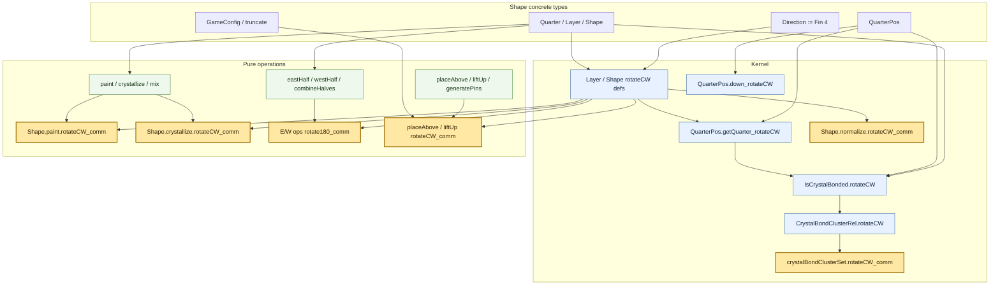
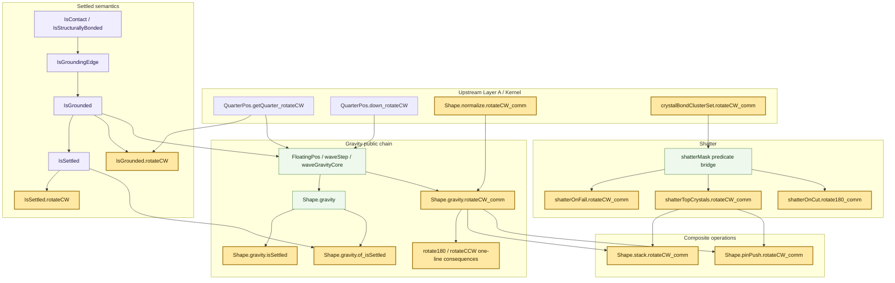

# Layer A/B アーキテクチャ（S2IL 正本）

- 作成日: 2026-04-24
- 最終更新: 2026-05-06
- ステータス: **Wave Gravity 実装・検証完了。Layer A/B 構造を運用中**
- スコープ: S2IL Layer A（データ型・Kernel・純粋関数な加工操作）および Layer B（振る舞い系）のコード構造
- 位置付け: 本ドキュメントは **新構造の正本** である。

---

## 0. このドキュメントの目的

S2IL の Layer A/B をゼロベースで設計する際の **コード構造の拘束条件** を定める。個別の補題や証明手順ではなく、

- ディレクトリ構造
- 公開 API / 非公開 API の境界
- Facade の責務
- MECE 分割原則
- 命名とサイズ上限
- インデックスに依存しないエージェント運用

といった「どの Layer にも横断的に適用される設計規約」を扱う。本ドキュメントが更新されたら、 [MILESTONES.md](../plans/MILESTONES.md) の該当箇所を必ず再確認する。

---

## 1. 設計原則

### 1.1 Facade 中心原則（公開 API の集約）

各名前空間につき `X.lean` ファイル 1 本を **facade** とし、そこに:

- すべての公開 `def` / `theorem` / `notation`
- 各公開 API の docstring（日本語、使用例つき）
- 「この module の目次」をコメントブロックで先頭に記載

を集約する。外部モジュール（別名前空間・Test・Layer C 以降）からの `import` は **facade のみ**に限定する。

facade の行数は **≤ 150 行** を硬い上限とする。超過しそうになった場合は:

1. 補助補題を `Internal/` に退避
2. 公開 API を見直して削減
3. それでも収まらなければ名前空間を分割（例: `Operations.Gravity` → `Operations.Gravity.Descent` を独立 facade に昇格）

のいずれかで対応する。facade を肥大化させない。

### 1.2 ディレクトリによる API 境界（Internal 原則）

各 facade `X.lean` には対応する `X/` ディレクトリがあり、次の構造を取る:

```
X.lean                  # facade（公開 API 集約、≤ 150 行）
X/
├── <公開部品>.lean       # facade から再エクスポートされる公開 API の実装
├── ...
└── Internal/
    └── <補助補題>.lean    # facade 経由でのみ到達可能な補助補題
```

**規約**:

- `X/Internal/` 以下は `X.lean` および `X/*.lean` からのみ `import` してよい
- 他の名前空間 / Test / Layer C 以降からの `X/Internal/` 直接 `import` は **禁止**
- `X/Internal/` 内の各ファイル冒頭に次の docstring を必須とする:

  ```lean
  /-!
  # Internal: <内容の 1 行要約>

  このファイルは `X` namespace の補助補題を集める。
  **外部モジュール（X.lean, X/*.lean 以外）からは import 禁止**。
  -/
  ```

- Lean の `private` 修飾子は file-private の範囲でのみ補助的に使う。API 境界の主手段はディレクトリ階層である。

### 1.3 MECE 分割原則

操作 / Kernel コンポーネントを構成するファイルは、次の 4 種類に分類する。層をまたぐ補題は書かない:

| カテゴリ | 数学的対象 | 例 |
|---|---|---|
| **Defs** | 純粋関数定義と構造的性質（length 保存、型レベル等式、場合分け）| `Operations/Gravity/Defs.lean` |
| **Behavior** | 時間発展・終端性・単調性・収束など Layer B 的性質 | `Operations/Gravity/Behavior.lean` |
| **Equivariance** | CW 回転との可換性（単一チェーン）| `Operations/Gravity/Equivariance.lean` |
| **Internal** | 上記 3 種を下支えする補助補題 | `Operations/Gravity/Internal/*.lean` |

- Layer A のみの操作（例: Rotator）は Behavior を持たない
- Layer B がある操作は Defs → Behavior → Equivariance の順序で依存する
- Defs が Behavior 固有の命題を含んではならない（逆も同様）

### 1.4 単一チェーン原則（等変性）

回転群 $\mathbb{Z}/4\mathbb{Z}$ は CW 回転 1 つから生成される。`Direction := Fin 4` での `+1` がこの生成元に対応する（§1.8）。各操作 `f` の等変性は **CW 回転との可換性 1 本だけ** を主証明とし、他の回転（180° / CCW）は機械的に導出する:

$$f(s.\mathrm{rotate180}) = f(s.\mathrm{rotateCW}.\mathrm{rotateCW}) = f(s).\mathrm{rotateCW}.\mathrm{rotateCW} = f(s).\mathrm{rotate180}$$

`Shape.rotate180 s := s.rotateCW.rotateCW`、`Shape.rotateCCW s := s.rotateCW.rotateCW.rotateCW` はいずれも `rotateCW` の合成として `noncomputable def` 化されている。`f_rotate180_comm` / `f_rotateCCW_comm` は facade 内で 1 行の系として定義し、独自の帰納証明を持たせない。

**禁止事項**: 操作 `f` について `f_rotateCW_comm` と `f_rotate180_comm` にそれぞれ独立した帰納法・場合分け証明を書くこと。

#### 1.4.1 例外: E/W 参照操作

**eastHalf / westHalf / combineHalves** は「絶対方角 E/W」に依存する 3 つの primitive 操作であり、CW 90° 回転は E/W 軸を N/S 軸へ写すため CW 等変性を持たない。
`cut` / `halfDestroy` / `swap` はこれら primitive の合成（`def`）として定義する。
`shatterOnCut` も E/W 軸依存のため同様。

反例 (`Shape.cut`): `s = CgRgCrSr` (NE=Cg, SE=Rg, SW=Cr, NW=Sr) のとき
- `s.rotateCW.cut` の東半分 = `SrCg----`
- `(s.cut.1).rotateCW` = `--CgRg--`

これらの操作は **180° 回転下でのみ** 等変性を持つ。180° 回転は `Fin 4` 上の `+2` であり E↔W を入れ替えるため、出力タプルの成分も swap される:

$$s.\mathrm{rotate180}.\mathrm{cut} = (s.\mathrm{cut.2}.\mathrm{rotate180},\ s.\mathrm{cut.1}.\mathrm{rotate180})$$

**原則**: E/W 参照操作の primitive（`eastHalf` / `westHalf` / `combineHalves`）については `rotate180_comm` を証明対象とし、CW_comm / CCW_comm は定義しない。合成操作（`cut` / `halfDestroy` / `swap`）の `rotate180_comm` は primitive 版の系として `theorem` 化する。

`halfDestroy` と回転操作を組み合わせた象限抽出は、ゲーム上の独立操作ではなく固定加工ラインの代表例として扱う。
そのため Layer A/B の Operation API や MAM 証明チェーンには置かず、C-1 Flow の処理能力テスト `Test/Flow/Capability.lean` で固定加工ラインの台数下界としてのみ扱う。

### 1.4.2 パイプライン操作（Stacker / PinPusher）

`Stacker` / `PinPusher` のような複合操作は、純粋関数 primitive を組み合わせた
**合成 def** として定義する。CW 等変性は primitive 各層の `rotateCW_comm` を
連鎖させて導出する。

**規約**:

1. `shatterTopCrystals` など `Classical.decPred` に依存する合成 def は `noncomputable` で宣言する。`gravity` は Wave Gravity として def/theorem 化済み
2. `generatePins` の CW 等変性は **2 引数同時持ち上げ**（`Shape` と `Layer` の両方を CW 化）として証明する。これは `pinPush.rotateCW_comm` で `s.pinLayerOf.rotateCW = s.rotateCW.pinLayerOf` を経由するためである
3. `Shape.bottomLayer` の CW 等変性（`s.rotateCW.bottomLayer = s.bottomLayer.rotateCW`）は `Operations.Common` で公開する
4. `Shape.truncate` の CW 等変性（`(truncate s c).rotateCW = truncate s.rotateCW c`）も同じく `Operations.Common` で公開する。`Shape/GameConfig.lean` は Kernel.Transform に依存しないため、回転系補題は `Operations.Common` 側に置く

実装は `S2IL/Operations/Stacker.lean` / `S2IL/Operations/PinPusher.lean` / `S2IL/Operations/Common.lean` 。
Gravity 依存の等変性は `Shape.gravity.rotateCW_comm` の theorem 化後、合成チェーンとして導出済み。
Stacker correctness の基礎 theorem として、`Shape.stack.isSettled`、`Shape.stack.layerCount_le`、`Shape.stack.singleQuadrant_invariants` を公開する。
レイヤ数上界は `Shape.shatterTopCrystals.layerCount_le` と `Shape.gravity.layerCount_le` を経由して導出する。
`Shape.stack.singleQuadrant_invariants` は保守的な invariants theorem であり、出力の正確な位置挙動までは主張しない。
位置挙動を強化する場合は、少なくとも crystal を含むか、pin を含むか、`config.maxLayers` が十分か、中間形状が settled / normalized かを分離してから theorem 化する。

### 1.4.3 砕け散り操作（Shatter）

クリスタル砕け散りの 3 種類（落下時 / 切断時 / 切り詰め時）は、いずれも
**「ある位置 `p` が砕けるか否か」を Prop 述語で定義し、`shatterMask` primitive で
該当位置の Quarter を `empty` に置換する** 統一構造で実装する。

**規約**:

1. `shatterMask` は Bool 述語を受ける純粋関数 primitive とする。決定可能性は `Classical.decPred` で `shatterOnFall` / `shatterTopCrystals` / `shatterOnCut` の各述語に与える（`noncomputable` で許容）
2. 各操作の等変性は **述語の CW シフトに対する可換性** に帰着させ、`shatterMask.rotateCW_comm` を 1 度通せば良い構造とする
3. `IsShatteredOnCut` の 180° 等変性証明では「E witness ↔ W witness の swap」を `Direction.isEast d → Direction.isWest (d+1+1)` の `decide` 補題 2 本（`hEW` / `hWE`）で閉じる
4. `Kernel.CrystalBondCluster` の `CrystalBondClusterRel.rotateCW (s p q) : CrystalBondClusterRel s.rotateCW p.rotateCW q.rotateCW ↔ CrystalBondClusterRel s p q` を直接使い、`crystalBondClusterList` のような順序依存の列挙を経由しない

実装は `S2IL/Operations/Shatter.lean` 。`Stacker` / `PinPusher` の `shatterTopCrystals` 利用は Shatter facade からの import に切り替え済み。

### 1.4.4 落下機構（Gravity）

落下処理は Layer B で唯一の重実装ノード。
過去に複数回の証明破綻を起こしているため、落下単位の順序付けや逐次着地処理を持たない **Wave Gravity** を採用する。
各 tick で `FloatingPos` 全体を同時に 1 層下へ移動し、浮遊象限がなくなるまで反復する。

**等変性に強い証明構造**:

1. 接地・浮遊の意味論は `IsGroundingEdge` / `IsGrounded` / `FloatingPos` の **Prop 層**を正本とし、`Relation.ReflTransGen` による可達性で述べる
2. `floatingMask` / `floatingPositions` / `groundedPositions` などの Bool/List 実装は派生ビューとし、公開仕様は `p ∈ xs ↔ P p` または `contains = true ↔ P p` の **membership bridge** に限定する
3. 接地閉包の実装に BFS や反復 closure を使う場合も、証明 API は順序非依存な membership / Finset / Prop 仕様を根に置く。`xs.rotate = xs.map rotate` のようなリスト順序等式を等変性の主定理にしない
4. CW 等変性は `IsGroundingEdge.rotateCW` → `IsGrounded.rotateCW` → `FloatingPos.rotateCW` → `waveStep.rotateCW_comm` の順に持ち上げる。閉包列挙の順序ではなく、各点の `getQuarter` 仕様と `ReflTransGen.lift` を使う
5. `waveStep` の仕様は `getQuarter` 点ごとの定理（static / cleared / unique preimage）で述べ、`foldl` や書き込み順序を公開意味論に含めない

実装は `S2IL/Operations/Gravity/` の `Defs` / `Behavior` / `Equivariance` / `Internal` 分割で完了済み。`Shape.gravity.isSettled`、`Shape.gravity.of_isSettled`、`Shape.gravity.rotateCW_comm` は theorem 化済みで、180° / CCW は CW 版からの 1 行系として維持する。

### 1.4.5 主要 theorem 証明チェーン

Layer A/B の主要 theorem は、概ね次のチェーンで持ち上がる。矢印は主な利用方向を表し、細部の補助補題は省略する。色付きノードは、Layer C 以降から参照される最終的に重要な公開 theorem を表す。

#### Layer A: 具象型・Kernel・純粋操作



#### Layer B: 振る舞い・安定化・複合操作



### 1.5 真偽検証先行原則

すべての補題・定理は、証明着手前に次のいずれかで **真と判明するまで signature を確定しない**:

1. `lean-theorem-investigator` で有効な Shape に対する反例検索
2. REPL `#eval` / `plausible` によるランダム検証
3. 数学的導出（既存の真定理からの含意）

偽と判明した命題は即座に signature を修正し、再検証する。**scaffold として sorry を書く前に必ず検証する**。

### 1.6 デッド補題クリーンアップ原則

補題が `lake build` を通しても、次に該当した時点で **削除候補** とする:

- フェーズ境界で誰からも参照されていない（`grep_search` で呼出 0）
- 同じ意味の補題がより簡潔に書き直された
- 上位補題が直接証明可能になり、経由する必要がなくなった

各フェーズ末に「デッド補題レビュー」を行い、候補をまとめて削除する。削除経緯は `git log` のみで残す（コード内アーカイブは作らない）。

### 1.7 認知負荷制約（インデックス不要原則）

本アーキテクチャでは **インデックス機構が存在しない前提** で設計する。エージェントが機械的インデックスなしでも低コストに探索できることを目標とする。

そのための具体的な拘束:

| 制約 | 値 |
|---|---|
| Facade 行数上限 | ≤ 150 行 |
| 一般ファイル行数上限 | ≤ 300 行 |
| Internal ファイル行数上限 | ≤ 300 行 |
| 1 ディレクトリ直下の `.lean` ファイル数 | ≤ 8 本（超過時はサブ namespace 化） |
| facade 冒頭の「目次」コメント | 必須 |
| `Internal/` docstring の「import 禁止」宣言 | 必須 |

残す補助情報:
- `S2IL/_agent/sorry-plan.json` — sorry の状態と依存
- `S2IL/_agent/sorry-goals.md` — sorry シグネチャ一覧（自動生成）

### 1.8 具象型規約（Direction / Layer / Shape の具体化）

Phase C 再 scaffold 以降、主要データ型は opaque `axiom T : Type` ではなく Mathlib / Lean 標準型で具体化する。これにより `DecidableEq` / `Fintype` / `Repr` 等のインスタンスが自動取得され、axiom を大幅に削減できる。

| 型 | Phase C の具象定義 | 根拠 |
|---|---|---|
| `Direction` | `abbrev Direction := Fin 4` | NE=0, SE=1, SW=2, NW=3。回転は `+1 (mod 4)`。`Fin 4` は `DecidableEq` / `Fintype` / `Repr` を自動取得 |
| `Quarter` | `inductive Quarter`（具体コンストラクタ: `empty` / `pin` / `crystal c` / `colored p c`）| Phase C で具体化。`DecidableEq` は `deriving` |
| `Layer` | `abbrev Layer := Fin 4 → Quarter` | 関数型で象限アクセスは `l d`。`Layer.rotateCW l := fun d => l (d - 1)`。`DecidableEq` は `Fin 4` の `Fintype` + `Quarter` の `DecidableEq` から自動 |
| `Shape` | `abbrev Shape := List Layer` | 0 層シェイプ（`[]`）を許容。`layerCount` は `List.length`。`rotateCW` は `List.map Layer.rotateCW` |
| `QuarterPos` | `abbrev QuarterPos := Nat × Fin 4` | レイヤ番号 × 方角。`rotateCW (n, d) := (n, d + 1)` |
| `Color` | `inductive Color` | Phase C で具体化 |
| `PartCode` / `RegularPartCode` | `inductive` | Phase C で具体化 |
| `GameConfig` | `structure GameConfig` | Phase C で具体化 |

**規約**:

1. `Direction.rotateCW (d : Fin 4) : Fin 4 := d + 1`。4 周性は `omega` で即閉じる
2. `Direction.isAdjacent (d1 d2 : Fin 4) : Bool := (d1 - d2 = 1) || (d2 - d1 = 1)`。同レイヤ内隣接が 1 式で統一
3. `Direction.isEast (d : Fin 4) : Bool := d.val < 2`。E/W 判定は `omega` で全自動化
4. `Layer.mk (ne se sw nw : Quarter) : Layer := ![ne, se, sw, nw]`（`Matrix.vecCons` リテラル）
5. `Layer.rotateCW (l : Layer) : Layer := fun d => l (d - 1)`。4 周性は `ext d; simp; ring_nf` で即閉じる
6. `Shape.rotateCW (s : Shape) : Shape := s.map Layer.rotateCW`。`Shape.rotate180` / `rotateCCW` は §1.4 単一チェーン原則で CW の合成
7. `Shape.mapLayers (s : Shape) (f : Layer → Layer) : Shape := s.map f`（`List.map` エイリアス）
8. Mathlib の `Equiv.addRight 1` (on `Fin 4`) を使えば回転を群作用として `MulAction` の補題群が利用可能
9. `Direction` 算術小補題（`Direction.add_one_sub_one` / `sub_one_add_one` / `add_one_sub_add_one` / `add_one_inj` / `sub_two_eq_add_two`）は `S2IL.Shape.Types` 内 `Direction` namespace に集約する。`Fin 4` の `+1`/`-1` 相殺・180°（`-2 = +2`）を再構築する `ext; simp [Fin.sub_def, Fin.add_def]; omega` パターンは原則これら補題に置換する。Mathlib 側に同等の `Fin n` 算術補題が存在しないため自前で持つ
10. `CrystalBondClusterRel` の n 段重ね等変性は `Kernel.CrystalBondCluster` 内に系列補題として備える。`CrystalBondClusterRel.rotateCW`（基本）/ `CrystalBondClusterRel.rotateCW_two`（180° 相当）/ `CrystalBondClusterRel.rotateCW_three`（CCW 相当）の 3 本。Operations 側で `(rotateCW _ _ _).mpr ((rotateCW _ _ _).mpr _)` のような繰り返し展開はこれら系列補題で 1 行化する

### 1.9 Option Shape 追放原則

Behavior レイヤ（Layer A/B）の全操作は **`Option Shape` を返さない全関数** として定義する。

| 旧（Phase B） | 新（Phase C 以降） |
|---|---|
| `gravity : Shape → Option Shape` | `gravity : Shape → Shape`（0 層入力 → 0 層出力） |
| `cut : Shape → Option Shape × Option Shape` | `cut : Shape → Shape × Shape`（0 層入力 → `(empty, empty)`） |
| `halfDestroy : Shape → Option Shape` | `halfDestroy : Shape → Shape` |
| `swap : Shape → Shape → Option Shape × Option Shape` | `swap : Shape → Shape → Shape × Shape` |
| `stack : Shape → Shape → GameConfig → Option Shape` | `stack : Shape → Shape → GameConfig → Shape` |
| `pinPush : Shape → GameConfig → Option Shape` | `pinPush : Shape → GameConfig → Shape` |
| `normalize : Shape → Option Shape` | `normalize : Shape → Shape`（0 層 → 0 層） |
| `ofLayers : List Layer → Option Shape` | 不要（`Shape := List Layer` なので恒等） |

**規約**:

1. 「装置は有効な入力が全部揃わないと出力しない」制約は **Machine レイヤ（Layer C/D）** の型で表現する: `Machine.process : MachineInput → Option Shape`（入力不正で `none`）
2. Behavior レイヤでは 0 層シェイプへの操作も自然に定義する（空リストへの `map` / `filter` / `append` は全て well-defined）
3. 等変性は直接等式で述べる: `(s.gravity).rotateCW = s.rotateCW.gravity`。`Option.map` / `Option.bind` は登場しない
4. Layer C/D で「1 層以上の Shape」が必要な場面では `Subtype (fun s : Shape => 0 < s.length)` を使い型制約で表現する

### 1.10 結晶結合クラスタ表現規約（関係と列挙の分離）

結晶結合クラスタ（`IsCrystalBonded` で連結された `QuarterPos` の集合）は、**関係層と列挙層を分離** して表現する。落下・接地で使う構造クラスタは `IsStructurallyBonded` 側の概念であり、この節の API とは分ける。

| 層 | 表現 | 用途 | 実装状況 |
|---|---|---|---|
| **関係層** | `CrystalBondClusterRel s := Relation.ReflTransGen (IsCrystalBonded s)` | 論理的性質（到達可能性・対称性・回転持ち上げ）。Mathlib `Relation.ReflTransGen` をそのまま利用する | ✅ Phase C 完了（axiom-free） |
| **集合層** | `crystalBondClusterSet s start : Finset QuarterPos`（`noncomputable`、`Classical.decPred` 経由）| 証明で使う正規表現。等変性は Finset 等式で述べる | ✅ Phase C 完了（axiom-free） |
| **列挙層** | `crystalBondClusterList s start : List QuarterPos` | `#eval` / 決定可能な計算で使う実装 | 🔜 Phase D（MAM/Shatter が必要時に追加） |
| **橋渡し** | `crystalBondClusterList_toFinset : (crystalBondClusterList s start).toFinset = crystalBondClusterSet s start`（1 本）| List 側と Finset 側の往復はこの 1 本経由でのみ行う | 🔜 Phase D |

**規約**:

1. 等変性・対称性・単調性など論理的命題は **必ず Finset 側（`crystalBondClusterSet`）で述べる**。`crystalBondClusterList` の List 等式（`crystalBondClusterList s.rotateCW _ = (crystalBondClusterList s _).map _` 等）は原則書かない。過去に探索順序差で補題が膨らんだ罠を避けるため、順序に依存する補題は作らない。
2. 関係層の閉包規則（`refl` / `head` / `tail` / `mono` / `lift`）は Mathlib `Relation.ReflTransGen` の既存補題をそのまま使う。同等の自前 `inductive` を `Kernel` 配下に再定義しない。
3. `crystalBondClusterList` は Phase D で MAM/Shatter が必要になったときに `Kernel/Internal/CrystalBondClusterImpl.lean` に閉じ込めた実装として導入し、公開 API からは隠蔽する。Phase C 終了時点では未導入。

**等変性の証明（Phase C 完了形）**:

```lean
-- CrystalBondClusterRel の双方向 lift（rotateCW / rotateCCW の bijection を経由）
theorem CrystalBondClusterRel.rotateCW (s : Shape) (p q : QuarterPos) :
  CrystalBondClusterRel s.rotateCW p.rotateCW q.rotateCW ↔ CrystalBondClusterRel s p q

-- Finset 等式は CrystalBondClusterRel.rotateCW + QuarterPos.allValid_rotateCW + bijection で導出
theorem crystalBondClusterSet.rotateCW_comm (s : Shape) (start : QuarterPos) :
  crystalBondClusterSet s.rotateCW start.rotateCW
    = (crystalBondClusterSet s start).image QuarterPos.rotateCW
```

実装は `S2IL/Kernel/CrystalBondCluster.lean`（axiom 0、`sorry` 0）。

### 1.11 Prop/Bool 二層規約

Bool 値述語と Prop 述語のペアは次の規約で統一する（CrystalBondCluster / Settled / Normalization / CrystalBond に共通適用）:

| 層 | 表現 | 例 |
|---|---|---|
| **Prop 層**（primitive） | `P : α → Prop` | `IsSettled`, `IsNormalized`, `IsCrystalBonded s p q` |
| **Decidable instance** | `instance : DecidablePred P` | Phase C で具体定義すれば自動取得 |
| **Bool 層**（派生） | `def p (x : α) : Bool := decide (P x)` | `isSettled`, `isNormalized`, `isCrystalBonded` |
| **橋渡し** | `theorem p_iff : p x = true ↔ P x := decide_eq_true_iff` | 自動導出（1 行） |

**禁止事項**: Prop 版と Bool 版を独立 axiom として並列宣言し、別個の橋渡し axiom を持たせること。

### 1.12 接地と安定の構造的定義（Settled）

落下・接地は時間発展ではなく **静的な可達性** で定義する（[docs/shapez2/falling.md §4.2](../shapez2/falling.md)）。

| 段 | 表現 | 役割 |
|---|---|---|
| **接触層** | `IsContact s a b : Prop` | 同方角・上下隣接（両非空）または同層・隣接方角（両非空・両非ピン） |
| **上方向接地接触層** | `IsUpwardGroundingContact s a b := IsContact s a b ∧ a.1 ≤ b.1` | 接地パスの方向制約 |
| **接地エッジ層** | `IsGroundingEdge s a b := IsUpwardGroundingContact s a b ∨ IsStructurallyBonded s a b` | 構造結合を含む剛体伝播 |
| **接地層** | `IsGrounded s p := ∃ p₀, p₀.1 = 0 ∧ ¬(getQuarter s p₀).isEmpty ∧ ReflTransGen (IsGroundingEdge s) p₀ p` | layer 0 の非空象限からの可達性（Mathlib `Relation.ReflTransGen`） |
| **安定層** | `IsSettled s := ∀ p ∈ allValid s, ¬(getQuarter s p).isEmpty → IsGrounded s p` | 浮遊単位ゼロ |

**規約**:

1. 接地・安定は Cluster と同じ `Relation.ReflTransGen` パターンに統一する（自前 inductive を使わない）
2. CW 等変性は `ReflTransGen.lift` + `QuarterPos.rotateCW/rotateCCW` の双射で導出（`Kernel.CrystalBondCluster` の証明テンプレートを使う）
3. `IsSettled` の決定可能性は `Classical.decPred` 経由で `noncomputable instance` を提供し、`isSettled : Bool` は派生（§1.11）
4. **`IsSettled.normalize` のような正規化保存は外部参照が発生してから追加する**（Phase D 着手時にデッド補題として削除済み）。新たに必要になった時点で `getQuarter_normalize` 等の補助補題込みで再導入する

実装は `S2IL/Operations/Settled.lean`（axiom 0、`sorry` 0）。

---

## 2. ディレクトリ構造（完全版）

```
S2IL.lean                          # ルート facade（全 Layer 再エクスポート、≤ 50 行）

S2IL/
│   ── Layer A: データ型 ──
├── Shape.lean                     # Shape 型系 facade
├── Shape/
│   ├── Types.lean                 # Direction:=Fin 4 / Quarter / Layer:=Fin 4→Quarter /
│   │                              #   Shape:=List Layer / QuarterPos:=Nat×Fin 4
│   ├── Types/
│   │   └── Atom.lean              # Color / PartCode / RegularPartCode（inductive）
│   ├── GameConfig.lean            # GameConfig structure + vanilla4/vanilla5/stress8 + truncate
│   ├── Arbitrary.lean             # Plausible インスタンス
│   ├── Notation.lean              # Quarter / Layer / Shape の文字列表現 + round-trip 定理
│   ├── Notation/
│   │   └── Atom.lean              # Color / PartCode / RegularPartCode の 1 文字表現
│   └── Internal/
│       ├── Parse.lean             # `:` 分割パーサ補助
│       └── Serialize.lean         # （プレースホルダ）
│
│   ── Layer A: カーネル ──
├── Kernel.lean                    # Kernel facade
├── Kernel/
│   ├── CrystalBond.lean           # IsCrystalBonded (Prop) + isCrystalBonded := decide 公開 API
│   ├── CrystalBondCluster.lean    # CrystalBondClusterRel / crystalBondClusterSet (Finset, noncomputable)（Phase C 完了形）
│   ├── Transform.lean             # rotateCW(=map Layer.rotateCW) / rotate180 / rotateCCW + bijection
│   └── Internal/
│       ├── CrystalBondClusterImpl.lean # crystalBondClusterList の実装（Phase D で追加予定。CrystalBondCluster.lean からのみ import）
│       ├── CrystalBondImpl.lean
│       └── Rotate180Lemmas.lean   # rotate180 = rotateCW ∘ rotateCW など書換系
│
│   ── Layer A: ワイヤー系（スケルトン） ──
├── Wires.lean                     # Wires facade（A-3）
├── Wires/
│   ├── Signal.lean                # A-3-1
│   ├── Gates.lean                 # A-3-2
│   ├── Elements.lean              # A-3-3 / A-3-4
│   └── Internal/
│
│   ── Layer A / B: 加工操作 ──
├── Operations.lean                # 全操作 facade（Layer C から参照される唯一の入口）
├── Operations/
│   ├── Common.lean                # 操作共通ユーティリティ（公開）
│   ├── HalfDestroyer.lean         # A-2-1
│   ├── Cutter.lean                # A-2-1 + B-4-2
│   ├── Swapper.lean               # A-2-1 + B-4-3
│   ├── Rotator.lean               # A-2-2
│   ├── Painter.lean               # A-2-3
│   ├── ColorMixer.lean            # A-2-3
│   ├── CrystalGenerator.lean      # A-2-6
│   ├── Stacker.lean               # A-2-4 + B-4-1
│   ├── PinPusher.lean             # A-2-5 + B-4-4
│   ├── Gravity.lean               # B-1（落下 + 終端性 + CW 等変性）
│   ├── Shatter.lean               # B-2
│   ├── Settled.lean               # B-3
│   └── <Op>/                      # 操作ごとに同一構造
│       ├── Defs.lean              # 純粋関数定義（Layer A）
│       ├── Behavior.lean          # 振る舞い系（Layer B、該当操作のみ）
│       ├── Equivariance.lean      # CW 等変性本体
│       └── Internal/
│           └── *.lean             # 補助補題（外部 import 禁止）
│
│   ── Layer A / B: Machine ──
├── Machine.lean                   # Machine facade
└── Machine/
    ├── <機構別>.lean
    └── Internal/

Test/
├── Shape/                         # Layer A: 型 + round-trip
├── Kernel/                        # Layer A: Cluster / Bond / Transform
├── Operations/                    # 純粋関数の代表値テスト
├── Behavior/                      # Layer B: 等変性・終端性
│   ├── Gravity.lean
│   ├── Shatter.lean
│   ├── Settled.lean
│   ├── Stacker.lean
│   ├── Cutter.lean
│   ├── Swapper.lean
│   └── PinPusher.lean
└── Machine/
```

### 2.1 名前空間と MILESTONES との対応

| ディレクトリ | MILESTONES の項目 | Layer |
|---|---|---|
| `Shape/` | A-1 | A |
| `Kernel/` | —（基盤）| A |
| `Wires/` | A-3 | A |
| `Operations/*.lean` の Defs 部 | A-2 | A |
| `Operations/*.lean` の Behavior 部 | B-1〜B-4 | B |
| `Operations/*/Equivariance.lean` | B-5 | B |
| `Machine/` | A-2 の統合 | A / B |

### 2.2 import ルール

- 外部から import してよいのは **facade (`S2IL.X` / `S2IL.X.Y`) のみ**
- `S2IL.X.Internal.*` はその namespace の owner 以外から import 禁止
- 循環防止のため Layer A → B → C → D の方向にのみ依存させる

---

## 3. Facade 規約

### 3.1 Facade 冒頭の目次

各 facade は次の形式のコメントブロックをファイル冒頭に持つ:

```lean
/-!
# <名前空間の要約>

## 公開 API

- `def foo` — 1 行説明
- `theorem foo_bar` — 1 行説明
- ...

## サブモジュール（公開）

- `S2IL.X.Y` — 役割
- `S2IL.X.Z` — 役割

## Internal（外部 import 禁止）

- `S2IL.X.Internal.*`
-/
```

この目次は docstring ではなくファイルレベルコメントとし、エージェントが `read_file` の先頭で全容を把握できるようにする。

### 3.2 Facade の内容

facade に置くもの:

- 公開 `def`（型シグネチャ + 短い定義または `X/` への委譲）
- 公開 `theorem`（主要定理 + 1 行系定義）
- 公開 `notation` / `instance`

facade に置かないもの:

- 帰納証明の本体（`X/<部品>.lean` または `X/Internal/` へ）
- 実装詳細の `def`
- Sanity test（`Test/` へ）

### 3.3 1 行系の書き方

等変性の 180° / CCW 版は facade に次のように書く:

```lean
/-- `gravity` は `rotate180` と可換（CW 版の系）。 -/
theorem gravity_rotate180_comm (s : Shape) :
    (s.rotate180).gravity = s.gravity.rotate180 := by
  simp only [rotate180_eq_rotateCW_rotateCW, gravity_rotateCW_comm]
```

系が 1 行で書けない場合、CW 版に問題があるとみなし再設計する（系のために新規補題を追加しない）。

---

## 4. Test 配置規約

- `Test/` 直下は Layer 別のサブディレクトリ（`Shape/` `Kernel/` `Operations/` `Behavior/` `Machine/`）に分ける
- 各テストファイルは対応する facade を 1 対 1 で import する
- `Internal/` を直接 import しない（API 境界の越境を防ぐ）
- Behavior テストは公開 API のみテストし、補助補題の単体テストは書かない

---

## 5. 命名規則（概要）

詳細は `docs/lean/naming-conventions.md` を参照。本ドキュメントでは構造的な規約のみを補強する。

### 5.1 サブ名前空間ドット規約

操作 `f` に関する定理は **`f.property` のドット区切り** で統一し、`f` のサブ名前空間に配置する。Lean 4 では `def Shape.gravity` と `theorem Shape.gravity.rotateCW_comm` が共存できる（定義と名前空間は独立）。

| カテゴリ | パターン | 例 |
|---|---|---|
| 等変性 | `<op>.rotate<CW\|180\|CCW>_comm` | `Shape.gravity.rotateCW_comm`, `Shape.paint.rotate180_comm` |
| 保存則 | `<Predicate>.<op>` | `IsSettled.rotateCW`, `IsCrystalBonded.symm` |
| 構造的性質 | `<op>.<property>` | `Shape.placeAbove.layerCount`, `Shape.truncate.idempotent` |
| 終端性 | `<op>.terminates` / `<op>.wellFounded` | `Shape.gravity.terminates` |
| Bool/Prop 橋渡し | `<boolFn>.iff` | `isSettled.iff`, `isCrystalBonded.iff` |
| Finset 橋渡し | `<listFn>.toFinset` | `crystalBondClusterList.toFinset` |

**例外**: `@[simp]` 定義展開 lemma (`:= rfl`) は従来のアンダースコアを維持する。例: `Shape.rotate180_eq_rotateCW_rotateCW`

### 5.2 Bool 述語接頭辞

`is` / `has` / `can` を許容する（例: `isEmpty`, `isBondable`）。

### 5.3 Internal 補助補題

名前の衝突を避けるため namespace prefix を使う（例: `Internal.FloatUnits.foldl_place_writes`）。

---

## 6. 参照されなくなった場合の流儀

- 1 Phase 以上参照 0 のまま残っている補題は、次の Phase 着手時に削除判断する
- 削除は git で履歴を残し、コメントアウト / アーカイブ 化は行わない
- 再度必要になったら `git log -S` で復元する

---

## 7. 関連ドキュメント

| ファイル | 用途 |
|---|---|
| [layer-ab-rewrite-plan.md](layer-ab-rewrite-plan.md) | 本アーキテクチャを実装する Phase 別手順 |
| [MILESTONES.md](MILESTONES.md) | 上位の最終目標と Layer 定義 |
| [docs/lean/naming-conventions.md](../lean/naming-conventions.md) | Lean の命名規則 |
| [docs/agent/proof-plan-current-focus-guide.md](../agent/proof-plan-current-focus-guide.md) | 新規 sorry 着手時の手順 |
